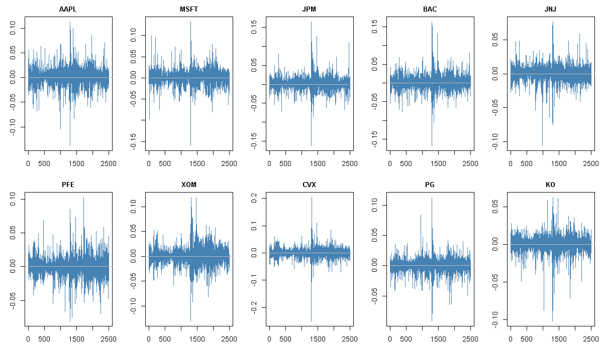
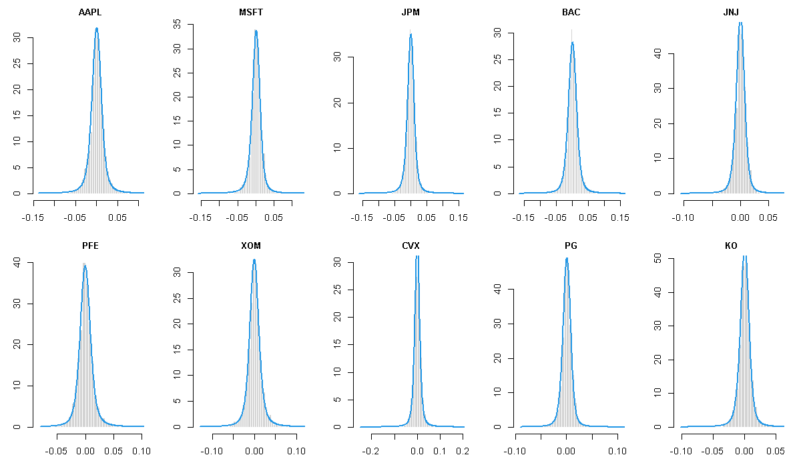
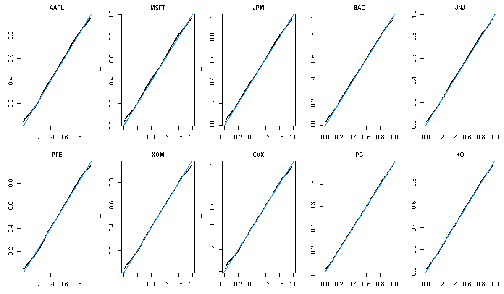
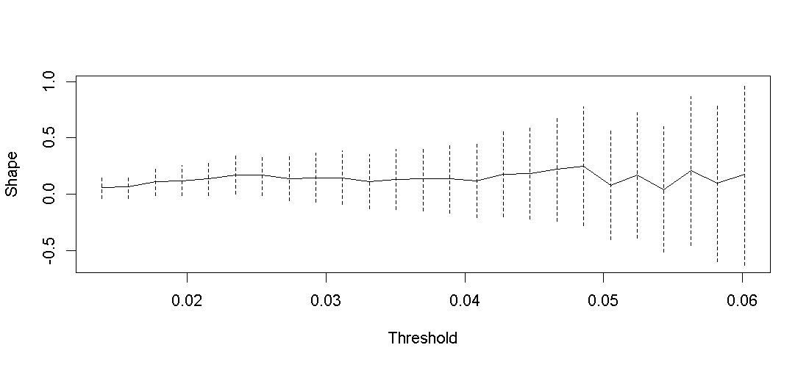
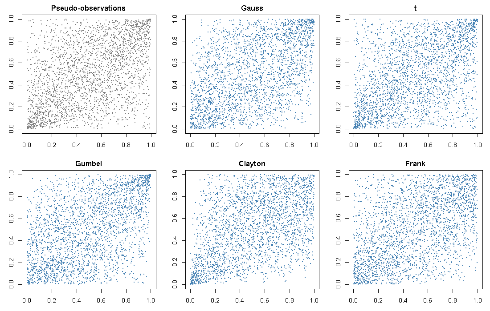
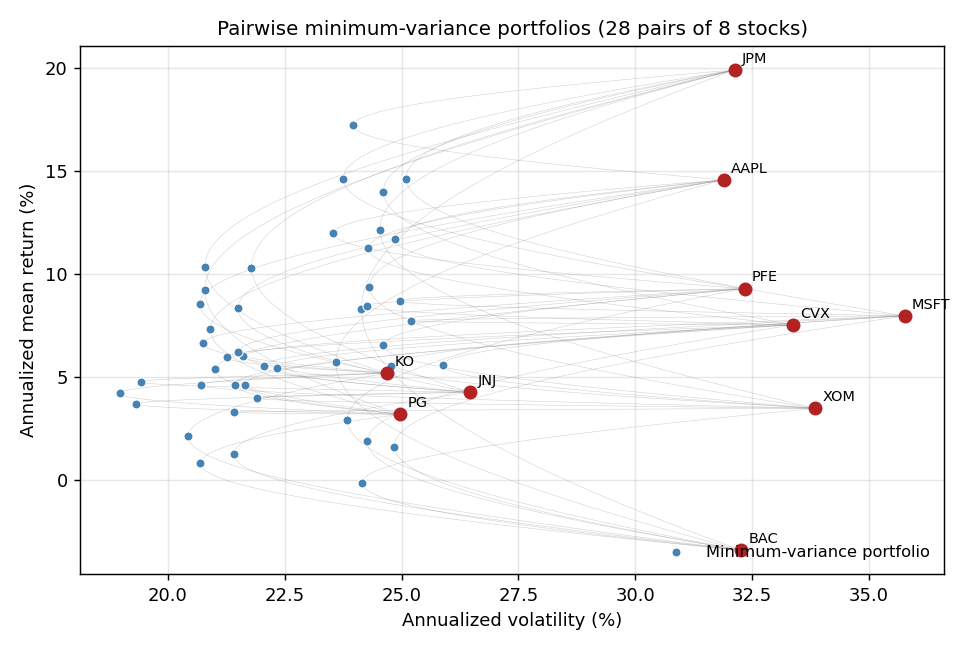
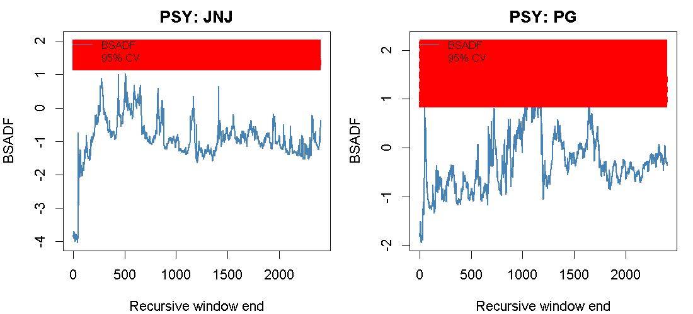

# Extreme Value Analysis and Portfolio Optimization for US Equities

A reproducible study of tail risk and pair-wise portfolio construction on a
sector-diversified basket of ten US large-cap stocks. The workflow fits
$\alpha$-stable, GEV and GPD distributions to the return / loss series,
compares five copula families for bivariate dependence, and combines the
two into copula-with-GPD-margins Monte Carlo estimates of joint tail risk.
Portfolio construction uses `tseries::portfolio.optim` (minimum variance)
and `fPortfolio::minriskPortfolio` (minimum 10%-tail CVaR); the PSY test
from `psymonitor` screens the selected pair for explosive price episodes.

Data comes from Yahoo Finance via [`yfinance`](https://pypi.org/project/yfinance/);
the rest of the analysis is R Markdown.

---

## Contents

- [Basket](#basket)
- [Methods](#methods)
- [Sample outputs](#sample-outputs)
- [Repository layout](#repository-layout)

---

## Basket

Ten large-cap US equities, two per sector across five sectors:

| Sector | Ticker 1 | Ticker 2 |
|---|---|---|
| Technology | AAPL (Apple) | MSFT (Microsoft) |
| Financials | JPM (JPMorgan Chase) | BAC (Bank of America) |
| Healthcare | JNJ (Johnson & Johnson) | PFE (Pfizer) |
| Energy | XOM (ExxonMobil) | CVX (Chevron) |
| Consumer Staples | PG (Procter & Gamble) | KO (Coca-Cola) |

The default date range is **2015-01-01 to 2024-12-31** (~10 years of daily
observations). Both the ticker list and the date range are configurable at
the top of `data_download.py`.

---

## Methods

**Univariate tail modelling.**

- $\alpha$-stable distribution fitting via `stableFit` (McCulloch's
  quantile estimator and MLE).
- Generalized extreme value (GEV) distribution fitted to block maxima of
  losses via `blockMaxima` + `gev.fit`; block-size sensitivity is checked
  across weekly / monthly / quarterly windows.
- Generalized Pareto (GPD) distribution fitted via the Peaks-Over-Threshold
  method; threshold selection uses the mean residual life plot
  (`evd::mrlplot`) and the threshold-choice plot (`evd::tcplot`).
- Goodness of fit: Michael's stabilized PP-plot, chi-squared test with
  parameter-count-corrected degrees of freedom, the built-in `ks.test`,
  and `gev.diag` / `gpd.diag` diagnostic panels.
- Value-at-Risk at the 99% level from four models (empirical, stable, GEV,
  GPD) with 95% bootstrap confidence intervals via `boot::boot` and
  `boot::boot.ci`; profile-likelihood intervals illustrated via `gev.prof`.

**Bivariate analysis.**

- Pair-wise portfolio construction across all 28 pairs of the remaining
  eight candidates after dropping the two riskiest stocks:
  - minimum-variance portfolio via `tseries::portfolio.optim`,
  - minimum 10%-tail CVaR portfolio via `fPortfolio::minriskPortfolio`
    (Rglpk solver).
- Bivariate extreme-value model (`fbvevd`) with symmetric logistic
  dependence on Fréchet-transformed margins; nonparametric Pickands
  dependence function (`abvnonpar`).
- Copula fits and comparison across Gaussian, Student-$t$, Gumbel, Clayton,
  and Frank families (`fitCopula`, `gofCopula` with Kendall-process
  $S_n$-statistic, Rosenblatt transform via `rtrafo`).
- Joint tail risk: probability of simultaneous VaR$_{99}$ breach, portfolio
  VaR$_{95/99/99.5}$, and CVaR$_{90}$ via $10^5$-sample Monte Carlo from
  the fitted copula with piecewise (empirical + GPD tail) marginals.

**Bubble diagnostic.** PSY (Phillips-Shi-Yu) test on the price series of
the selected pair with `psymonitor::PSY` and wild-multiplier bootstrap
critical values via `cvPSYwmboot`.

**Stability check.** All univariate fits are recomputed on the second half
of the sample; Kendall's $\tau$ measures the persistence of the risk
ranking.

---

## Sample outputs

*The figures below are illustrative samples generated from synthetic data
with realistic properties (heavy tails, volatility clustering,
cross-sectional correlation). They are overwritten by real analysis output
whenever `stock_analysis.Rmd` is knit, via the `export-figures` chunk at
the end of the report.*

### 1. Log-return time series



Standard equity-return stylized facts are visible: approximately zero
mean, heavy tails, and volatility clustering. Empirical excess kurtosis is
well above zero for every stock.

### 2. Stable distribution fits



The fitted $\alpha$-stable density (blue) matches the body of the
empirical distribution; the tail behaviour drives the risk parameters
$\alpha$ and $\beta$ that feed the risk ranking.

### 3. Goodness of fit -- Michael's stabilized PP-plot



Under a correct model the plotted points lie on the diagonal. Small
deviations at the tail ends are consistent with sampling variability.

### 4. GPD threshold selection



`evd::tcplot` shows the fitted GPD shape $\xi$ and modified scale
$\sigma^\ast$ as functions of the threshold with 95% confidence bands. The
threshold is set at the 95% empirical quantile where both parameters
stabilize.

### 5. Copula comparison



The upper-left panel shows the empirical pseudo-observations for the
selected pair; the remaining panels show samples drawn from each fitted
copula. The best model is selected by the `gofCopula` p-value.

### 6. Portfolio frontier and pair selection



Every pair of the eight remaining stocks defines a small efficient
frontier (grey); the minimum-variance point of each pair is marked in
blue, individual stocks in red. The selected pair (smallest 10%-tail
CVaR of the CVaR-optimal portfolio) is highlighted in the report.

### 7. PSY bubble test



Recursive BSADF statistic against the 95% wild-multiplier bootstrap
critical value. Windows in which BSADF exceeds the critical value indicate
explosive price behaviour compatible with a bubble.

---

## Repository layout

```
.
├── README.md                    # This file
├── data_download.py             # yfinance downloader -> data/stock_prices.csv
├── stock_analysis.Rmd           # Main analysis (R Markdown)
├── data/
│   └── stock_prices.csv         # (gitignored; produced by data_download.py)
└── figures/                     # Figures embedded in README + rendered report
    ├── returns_timeseries.png
    ├── stable_fits.png
    ├── michael_pp.png
    ├── tcplot.png
    ├── copula_scatter.png
    ├── portfolio_frontier.png
    └── psy_test.png
```

---
